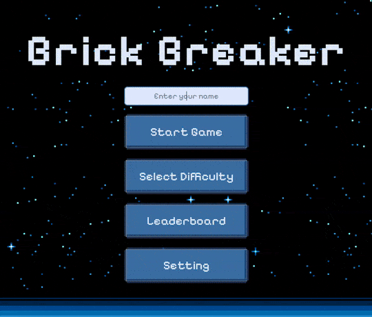

# brick-breaker

A classic brick-breaking web game built with HTML, CSS, and JavaScript.

[](LICENSE)
[](https://ramadan-swe.github.io/brick-breaker/)

---

## Overview

**brick-breaker** is a simple yet addictive web game where the player controls a paddle to bounce a ball and break as many bricks as possible. The game features multiple levels, power-ups, and a scoring system.

- [brick-breaker](#brick-breaker)
  - [Overview](#overview)
  - [Getting Started](#getting-started)
    - [Demo Try it out online](#demo-try-it-out-online)
    - [Game Mechanics](#game-mechanics)
    - [Features](#features)
    - [How To Play](#how-to-play)
    - [Objective](#objective)
    - [Playing with the Keyboard](#playing-with-the-keyboard)
    - [Playing with the Mouse](#playing-with-the-mouse)
    - [Winning \& Losing](#winning--losing)
    - [Installation (local)](#installation-local)
  - [Project Structure](#project-structure)
  - [Contributing](#contributing)
  - [License](#license)

---

## Getting Started

### Demo [Try it out online](https://ramadan-swe.github.io/brick-breaker/)



---

### Game Mechanics

- **Paddle**: Controlled by the player using the left and right arrow keys.
- **Ball**: Bounces off the paddle, bricks, and walls.
- **Bricks**: Can be broken by the ball to increase the score.
- **Power-ups**: Occasionally appear to enhance the player’s abilities (e.g., larger paddle, extra lives).

### Features

- 🎮 Multiple levels with increasing difficulty
- 🔊 Sound effects for ball collisions and power-ups
- 🏆 Scoring and high score tracking
- ⭐ Power-ups to boost gameplay

---

### How To Play

---

### Objective

Break all the bricks on the screen by bouncing a ball off your paddle without letting the ball fall below the paddle.

---

### Playing with the Keyboard

1. **Move the Paddle**

   - Press **Left Arrow (←)** to move the paddle left.
   - Press **Right Arrow (→)** to move the paddle right.

2. **Controls**

   - Press **Space** to start the game or launch the ball.
   - Press **ESC** to pause the game.
   - Press **ESC** again while paused to return to the main menu.

3. **Gameplay**

   - Continue moving left and right to keep the ball bouncing.
   - Catch falling power-ups for bonuses, and avoid traps (like shrinking the paddle).

---

### Playing with the Mouse

1. **Move the Paddle**

   - Move your mouse left or right to slide the paddle horizontally at the bottom of the screen.
   - The paddle follows your mouse movement in real time.

2. **Gameplay**

   - Use the mouse only to move the paddle.
   - The ball can only be launched by pressing **Space** on the keyboard.

---

### Winning & Losing

- **Win**: Clear all the bricks on the level.
- **Lose**: Miss the ball and let it fall below the paddle too many times (lives run out).

### Installation (local)

1. Clone the repository:

   ```bash
   git clone https://github.com/ramadan-swe/brick-breaker.git
   ```

2. Navigate to the project directory:

   ```bash
   cd brick-breaker
   ```

3. Start the game locally using one of these options:

   **Python**

   ```bash
   python3 -m http.server 8000
   ```

   **Node.js**

   ```bash
   npm install -g serve
   serve -l 8000 .
   ```

---

## Project Structure

```bash
brick-breaker/
├── Fonts/                     # Game fonts
├── assets/                    # Game assets
├── src/                       # Source code
│   ├── Ball.js
│   ├── Brick.js
│   ├── Game.js
│   ├── Music.js
│   ├── Paddle.js
│   ├── main.js
│   ├── menu.js
│   └── powerup.js
├── index.html                 # Entry point
├── style.css                  # Game styling
├── LICENSE
└── README.md
```

---

## Contributing

Contributions are welcome!

1. Fork the repository
2. Create a new branch:

   ```bash
   git checkout -b feature/my-feature
   ```

3. Commit your changes
4. Push to your fork and open a Pull Request

---

## License

This project is licensed under the MIT License – see the [LICENSE](LICENSE) file for details.
